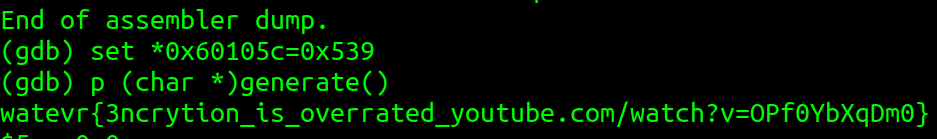

# timeout

* Upon investigating it in `IDA`, we saw that it has a simple `main` function that calls a delay. After that, it then set a variable to `1337` and quits the program.

* After looking at other functions in the program, I spot a function called `generate`. In this function, the program checks a global variable has the value `1337`, and if it does, then it then outputs a string with `puts`. (I assume that wil be our secret flag). 

* After finding the function that will output the secret flag, we have to make the program to execute that function. 

* There are a couple ways that we can do that. 

## Method 1
* We can use `gdb` to attach to the program. When it is lunched, we can set the instruction pointer `rip` to be the memory address of `generate`. We can get the memory location via this `gdb` command: `p &generate`. 
* Then, we can set the global variable `0x60105d` to have the value of `1337`. This is so that when we continue to run the program, the program would have a valid value to execute the secret function

## Method 2
* We can again use `gdb` to find the flag. This time, we can directly run the secret function with the following command after we set the global variable.
```
p (char *) generate()
```


## Method 3
* We can use `hexedit` to change the function to `generate` when we calling `signal` in `main`, and then change the `jne` to `je` when we compare if the global variable has been set.

* We can also just overwrite bytes after the program set the secret variable in main with a call instruction to `generate`, this will corrupt the binary afterwards,  but since we just want to call `generate` to print out the flag, we don't need to worry about anything afterwards.

* watevr{3ncrytion_is_overrated_youtube.com/watch?v=OPf0YbXqDm0}
